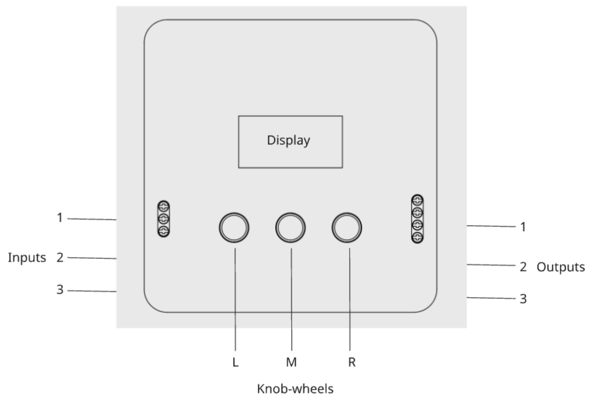

Audio-Box
=========

The Audio-Box is a bidirectional streaming device. It can send an audio-signal from one box to another, and receive an audio-signal from another box.
It can be connected to the internet through Ethernet or through Wifi.
Additionally, the signals can be listened to and minotored through a browser interface or through a MaxMSP environment.

The Audio-Box
-------------

Functions
^^^^^^^^^

**Input 1**: line in (TRS)

**Input 2**: microphone input ()

**Input 3**: microphone input (TRS, plugin-power)

**Output 1**: headphones (TRS)

**Output 2**: output ()

**Output 3**: loudspeakers

**Knob-wheel L**:
* press and turn: choose channel to send audio [1–15]
* turn: input gain
* double press: choose codec (pcm [uncompressed], `qoa <https://qoaformat.org/>`_, aac)

**Knob-wheel M**:
- double press: toggle between local monitoring (input = output) or streaming (input to remote, output from remote)

**Knob-wheel L**:
- press and turn: choose channel to receive audio [1–15]
- turn: output gain

Connect to WiFi
^^^^^^^^^^^^^^^

 
Download NAOS helper-tool from here: 

:download:`NAOS <_downloads/audio-box/NAOS.zip>`

Unzip, move it to Application folder and open.

MaxMSP
^^^^^^
Download Max external:

:download:`Maxesternal <_downloads/audio-box/audio-box.zip>`

Download example patch:

:download:`Maxpatch <_downloads/audio-box/AudioBox.maxpat>`

