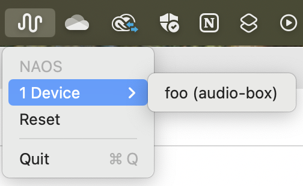
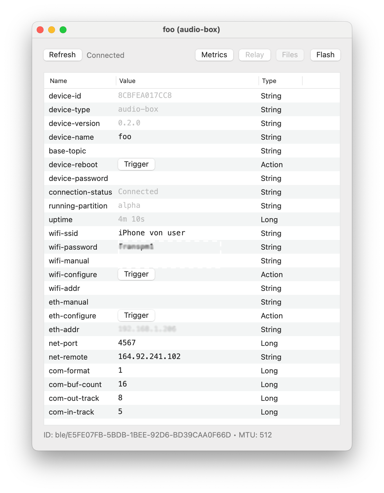
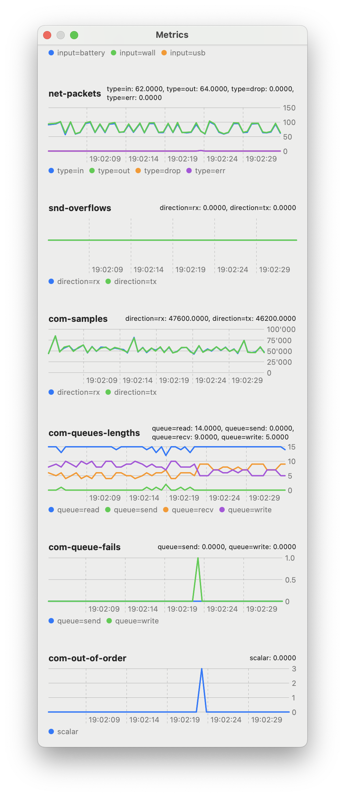
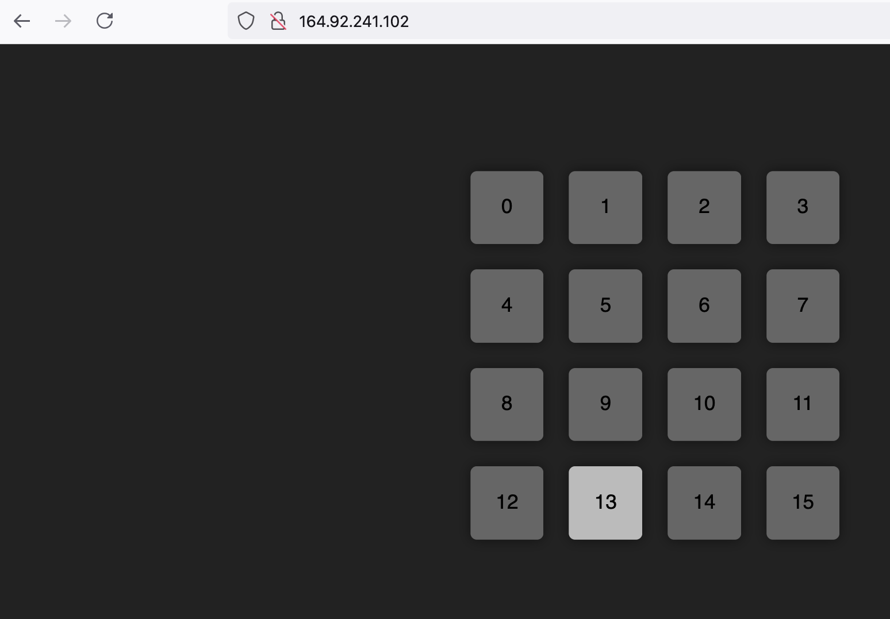
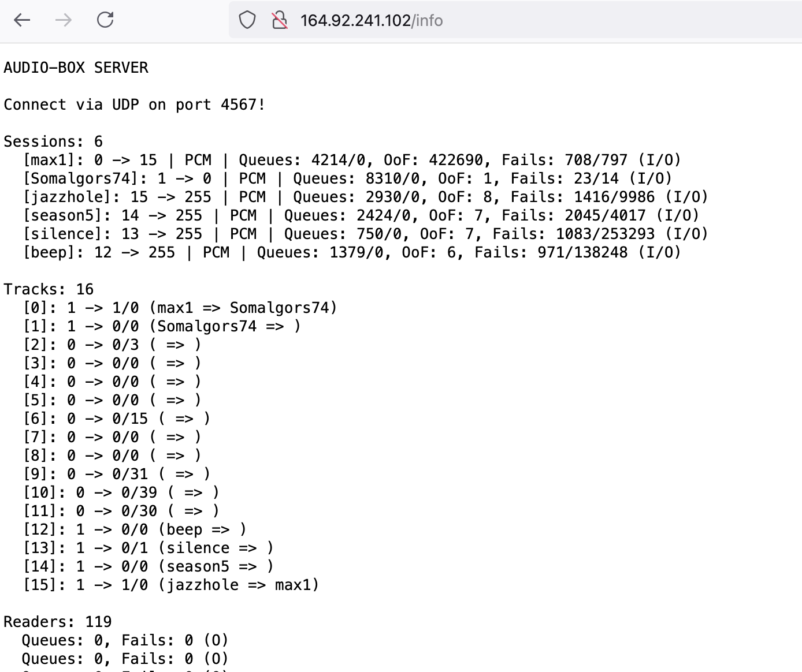
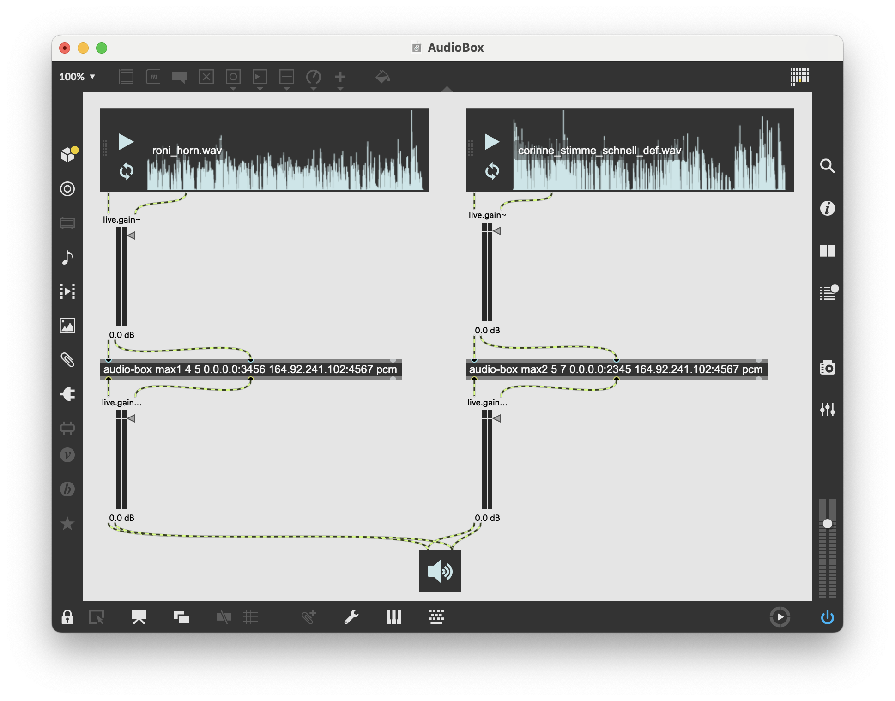

Audio-Box
=========

The Audio-Box is a bidirectional streaming device. It can send an audio-signal from one box to another, and receive an audio-signal from another box.
It can be connected to the internet through Ethernet or through Wifi.
Additionally, the signals can be listened to and minotored through a browser interface. It is also possible to send and receive audio ih a MaxMSP environment.

Technically, it builds on a `ESP32-S3-WROOM-2 <https://www.espressif.com/en/products/socs/esp32-s3>`_ microcontroller with a `MAX90890 <https://www.analog.com/en/products/max98090.html#documentation>`_ ultra-low power stereo audio codec, packed, with additional modules for ethernet and battery into a case. 

Functions of the Audio-Box
--------------------------

.. image:: _static/audio_box_s.png
   :alt: Alternate text
   :align: center
   :width: 400px

- **Inputs:**

   - **1**: line in (stereo, TRS)
   - **2**: microphone input (mono, micro three-pin, plugin-power)
   - **3**: microphone input (mono, mini-jack TRS, plugin-power)

- **Outputs:** 

   - **1**: headphones (stereo, TRS, low-impedance)
   - **2**: loudspeaker output (stereo, pins, low-voltage)
   - **3**: loudspeaker output (TRS)

- **Knob-wheel L:**

   - **press and turn:** choose channel to send audio [1–15]
   - **turn:** input gain
   - **double press:** switch between codecs (pcm [uncompressed], `qoa <https://qoaformat.org/>`_, aac)
   - **press:** switch between line input and microphone input

- **Knob-wheel M:**

   - **press long:** switch device on or off
   - **double press:** toggle between local monitoring (input = output) or streaming (input to remote, output from remote)

- **Knob-wheel R:**

   - **press and turn:** choose channel to receive audio [1–15]
   - **turn:** output gain
   - **double press:** switch between headphone output and amplifier output

- **Backside:** USB-C (for power), ethernet, power

Connect to the Internet
-----------------------

You can connect the audio-box to the internet through ethernet; you can see a successful connection when the display turns from ``DISC`` to ``ETH``.

A connection through WiFi is also possible through a desktop computer. For this, download the NAOS helper-tool from here:

:download:`NAOS <_downloads/audio-box/NAOS.zip>`

Unzip, move it to Application folder and double click to open.
In the title bar, you find a wave-sign where you can choose an audio-box if connected:

A window opens: 

Type your wifi- or hotspot-address after ``wifi-ssid`` and the password after ``wifi-password``. Click ``Trigger`` to activate. 
The ``connection-status`` turns to ``Connectec``, and the display of the audio-box should turn from ``DISC`` to ``WIFI``.

Additionally, you can monitor your device by clicking on ``Metrics``:

Web-Interface
-------------

Individual channels can be monitored through a web-interface, e.g. on http://164.92.241.102/:

On http://164.92.241.102/info, the status of the connected devises can be monitored:

MaxMSP-Interface
----------------

Additionally, streams can be sent and received in the MaxMSP environment:

In the above example, the left ``audio-box``-object has the following arguments:

- [1] name (max1): individual name
- [2] int (4): channel number audio is sent to
- [3] int (5): channel number audio is received from
- [4] ip-address:port (0.0.0.0:3456): local ip-address and port
- [5] ip-address:port (164.92.241.102:4567): server ip-address and port
- [6] xxx (pcm): codec (pcm, qoa or aac)

The first two inlets and outlets are the left and right channels; the third outlet gives the status e.g. to a message box.

The example patch can be downloaded here:

:download:`Max-patch <_downloads/audio-box/AudioBox.maxpat>`

The ``audio-box`` object builds on a max external that can be downloaded here:

:download:`Max-external <_downloads/audio-box/audio-box.zip>`

After download, unzip and move it to the ``Packages``-folder of Max.

